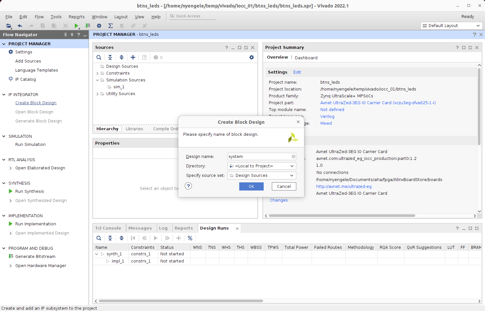
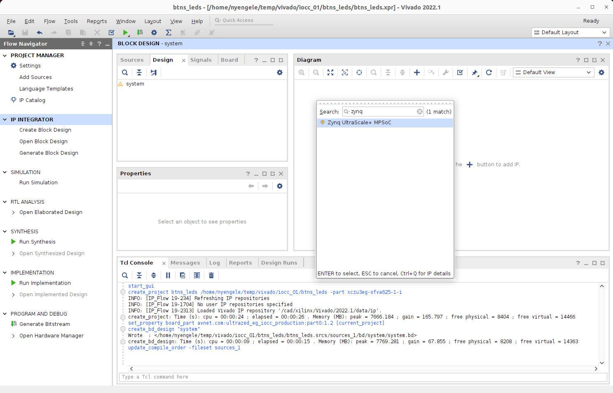

# Tutorial : Buttons and LEDs

## Prerequisites

1. Vivado 2022.1 accessible
2. Board files for Avnet boards are accessible from Vivado

### 1. Launch Vivado


### 2. Set Path for Board Files

in the `Tcl Console` on the bottom of the screen, point Vivado to the directory
containing board files for Avnet IO Carrier Card (let's call it REPO_PATH)
```sh
set_param board.repoPaths {REPO_PATH}
```

Enter the Tcl command above (with REPO_PATH substituted for the real directory path) and press ENTER.


### 3. Create New Project

- click on `Create Project` to create a new project
- click `Next` from the new window


### 4. Set Project Name

On the new window screen,
- provide the name of the project (**btns_leds**)
- validate the `Project location` entry (user has read/write permissions to the path)
- check the `Create project subdirectory` option
- Click `Next`


### 5. Set Project Type

On the new window screen,

- select `RTL Project`
- check `Do not specify sources at this time` under the `RTL Project` choice
- click `Next`


### 6. Select Target Board

- click on `Boards` near the top of the window
- type `carrier card` in the search bar
- click on `Avnet UltraZed-3EG IO Carrier Card` to select it
- click `Next`
- click `Finish` on the `New Project Summary` window that opens next


### 7. Create a Block Design

- on the left side of the window (in the `Flow Navigator` pane), go to `IP INTEGRATOR`
and click `Create Block Design`
- then, on the `Create Block Design` window that opens:
    - change Design name to `system` (the name `system` isn't special. It's just our choice)
    - leave the Directory setting to `<Local to Project>`
    - leave `Specify source set` to `Design Sources`
    - click `OK`



- wait for the block design to be created. Then, the following blank design should be ready


### 8. Add the ZynqMP Processor Subsystem

- click on the `+` button in the toolbar within the `Diagram` pane to open the search pane for the IP Integrator
- type `zynq` in the search box
- double-click on `Zynq UltraScale+ MPSoC` to add the ZynqMP to the block design



- the ZynqMP processor subsystem should now be added to the block design as shown in the picture below:


### 9. Configure ZynqMP Processor Subsystem

A significant advantage of using board files is that most board-specific configurations for the processor subsystem can be automated.

- first, click on `Run Block Automation` in the `Diagram` pane to open the block automation dialog box
